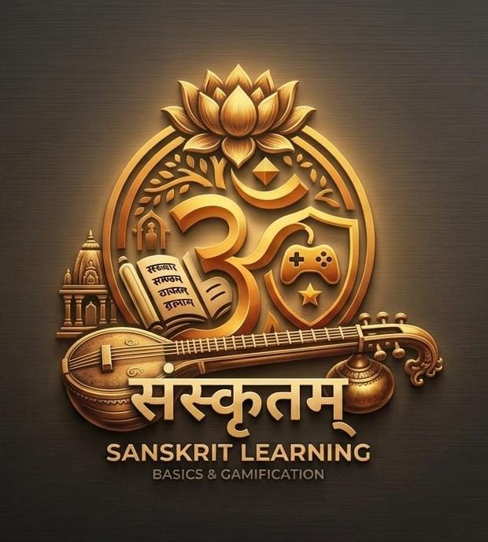

# 🕉️ Sanskrit Setu (संस्कृत सेतु)

<div align="center">



### *Bridge to Ancient Wisdom through Modern Technology*

[](https://expo.dev)
[](https://reactnative.dev)
[](https://www.typescriptlang.org/)
[](https://www.sarvam.ai)
[](https://supabase.com)

</div>

---

## 📖 Overview

**Sanskrit Setu (संस्कृत सेतु)** is an immersive, modern, and interactive mobile application built with React Native and Expo. It bridges ancient Indian linguistic heritage with cutting-edge web and AI technologies.

Featuring a custom **"Royal Peacock"** and **"Midnight Temple"** dual-theme system, glassmorphism UI elements, real-time AI translation, direct Supabase cloud library downloads, embedded YouTube masterclasses, and endless gamified learning challenges.

---

## 🌟 Interactive Learning Modules

### 🔤 1. Anuvadak (अनुवादक - Sarvam AI Neural Translator)
Real-time neural translation powered by **Sarvam.ai (`sarvam-translate:v1`)**.
- 🔄 **4-Language Support**: English (`en-IN`), Sanskrit (`sa-IN`), Hindi (`hi-IN`), and Marathi (`mr-IN`).
- ⚡ **Bi-directional Translation**: Seamlessly translate back and forth between any language pair.
- ⏱️ **Debounced Auto-Translation**: Live typing response with loading indicators (`<ActivityIndicator>`).
- 📋 **One-Tap Clipboard Copy**: Easily copy translated Devanagari output.

---

### 📚 2. Granthalaya (ग्रन्थालयः - Supabase PDF Library)
A curated digital library for sacred texts, philosophy, and classical literature hosted on **Supabase Storage**.
- ⚡ **Direct PDF Access**: High-speed direct previewing and one-tap PDF downloading.
- 📜 **Featured Sanskrit Texts**:
  - **Atharva Veda (अथर्ववेदः)** — Sacred Samhita & hymns.
  - **Vaimanika Shastra (वैमानिक शास्त्र)** — Maharshi Bharadwaja's treatise on ancient aeronautics.
  - **Vivekachudamani (विवेकचूडामणिः)** — Adi Shankaracharya's masterwork on Advaita Vedanta.
- 🔍 **Live Search & Category Filtering**: Search by title, author, or filter by *Grammar*, *Scriptures*, *Philosophy*, or *Chants*.
- 📖 **Interactive Book Modal**: View detailed book cards, metadata, and action buttons.

---

### ▶️ 3. Gurukul (गुरुकुलम् - YouTube Masterclasses)
A masterclass video platform featuring hardcoded YouTube video lessons (`data/videos.json`).
- 🖼️ **Dynamic YouTube Thumbnails**: Automatically fetches high-resolution thumbnails via YouTube CDN (`img.youtube.com`).
- 🏷️ **Categories & Difficulty Levels**: Filter video masterclasses by *Pronunciation*, *Grammar*, *Conversation*, or *Chanting*.
- 🎬 **Embedded Video Player Modal**:
  - **Web**: Embedded YouTube iframe player (`https://www.youtube.com/embed/<id>`).
  - **Mobile**: Direct launcher button to watch inside YouTube app.

---

### 🎮 4. Khela Room (खेला - Dynamic Infinite Gamification)
An interactive learning suite with infinite round generation and level progression.

| Game Mode | Description | Highlights |
| :--- | :--- | :--- |
| 🧩 **Word Chain (शब्दशृंखला)** | Build classical Sanskrit quotes & proverbs | 12+ proverbs (Satyameva Jayate, Vasudhaiva Kutumbakam, etc.) with scrambled brick pools. |
| 🖼️ **Picture Quiz (चित्रपरिचयः)** | Identify Sanskrit symbols and vocabulary icons | 14+ icon challenges (*Sun, Moon, Book, Rain Cloud, Peacock Feather, Fire, Mountain*). |
| 📝 **Sentence Master (वाक्यपूर्तिः)** | Complete Sanskrit sentences with correct verb conjugations | 15+ grammar fill-in-the-blank questions (Vibhakti, Lakara, Purusha). |

- 🏆 **Scholar Rank System**: Progress from **Prarambhika** *(Beginner)* → **Madhyama** *(Intermediate)* → **Kovidha** *(Proficient)* → **Acharya** *(Scholar Master)* based on earned XP.
- 🔄 **Infinite Multi-Round Engine**: Reshuffles questions and multiple-choice options dynamically for endless replayability.

---

## 🎨 UI / UX Aesthetics

- **Adaptive Dual Themes**: Switch between **Royal Peacock (Light Mode)** and **Midnight Temple (Dark Mode)** with a single tap.
- **Glassmorphism Design**: Frosted glass effects (`BlurView`) over video player buttons and headers.
- **Modern Typography**: Clear high-contrast font styles optimized for both Devanagari script and Latin text.

---

## 📁 Repository Structure

```text
sanskrit-learning-app/
├── assets/                  # App icon, logo, and static media
├── components/
│   └── khela/               # Khela Room Game Components
│       ├── CompleteSentence.tsx  # Grammar fill-in-the-blank game
│       ├── GuessImage.tsx        # Picture symbol quiz game
│       ├── KhelaMenu.tsx         # Khela room lobby & scholar rank
│       ├── WordChain.tsx         # Sentence brick builder game
│       └── khelaState.ts         # XP tracking & rank calculation
├── data/
│   ├── books.json           # Supabase Storage PDF library dataset
│   └── videos.json          # YouTube video masterclasses dataset
├── App.tsx                  # Main Navigation, Theme System & Screens
├── app.json                 # Expo application configuration
├── package.json             # Project dependencies and scripts
└── tsconfig.json            # TypeScript configuration
```

---

## 🛠️ Tech Stack

| Domain | Technology |
| :--- | :--- |
| **Framework** | [React Native](https://reactnative.dev/) (Expo SDK 57) |
| **Language** | [TypeScript](https://www.typescriptlang.org/) |
| **Neural AI Translation** | [Sarvam.ai API](https://www.sarvam.ai) (`sarvam-translate:v1`) |
| **Cloud Storage** | [Supabase Storage](https://supabase.com) (PDF hosting) |
| **Navigation** | `@react-navigation/bottom-tabs` v7 |
| **Icons** | `lucide-react-native` |
| **Visual Effects** | `expo-blur`, `expo-linear-gradient` |
| **Local Storage** | `@react-native-async-storage/async-storage` |

---

## 🚀 Getting Started

### Prerequisites

- [Node.js](https://nodejs.org/) (v18 or higher recommended)
- [Expo Go](https://expo.dev/client) app installed on your physical mobile device (or Android Studio / Xcode for simulators)

### Installation

1. **Clone the repository**
   ```bash
   git clone https://github.com/mustuchulaw/sanskrit-learning-app.git
   cd sanskrit-learning-app
   ```

2. **Install dependencies**
   ```bash
   npm install
   ```

3. **Start the Expo development server**
   ```bash
   npm start
   ```

### Command Shortcuts

| Command | Action |
| :--- | :--- |
| `npm run start` | Launch Expo development server & QR code |
| `npm run web` | Run application in desktop browser |
| `npm run android` | Launch in Android Emulator |
| `npm run ios` | Launch in iOS Simulator |

---

## 🤝 Contributing

Contributions are welcome! If you'd like to add new Sanskrit literature, extra video lessons, or new Khela room games:

1. Fork the Project
2. Create your Feature Branch (`git checkout -b feature/AmazingFeature`)
3. Commit your Changes (`git commit -m 'Add some AmazingFeature'`)
4. Push to the Branch (`git push origin feature/AmazingFeature`)
5. Open a Pull Request

---

## 📜 License

Distributed under the MIT License. See `LICENSE` for details.

<div align="center">
  <sub>Built with ❤️ for Sanskrit learners worldwide</sub>
</div>